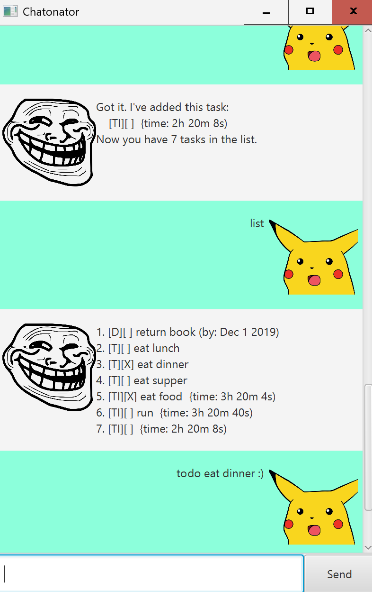

# Chatonator User Guide



Welcome to Chatonator, your ultimate tool for managing and organizing 
your tasks efficiently for fast typers. With Chatonator, you can easily add deadlines, 
mark tasks you completed, in order to track your progress!

## Getting Started 
You can add and view tasks using simple commands. Tasks can also be saved.

## Viewing tasks `list`
Simply type 'list' to view all current tasks.

## Adding deadlines `deadline`
Type `deadline <task-name> /by YYYY-MM-DD` to add a deadline to your task list.

Example: `deadline Get A Job /by 2024-12-31`
```
Outcome: The task "Get A Job" with a deadline of December 31, 2024, will be added to your task list.
```

## Adding to-dos `deadline`
Type `todo <task-name>` to add a to-do task to your task list.

## Adding events `event`
Type `event <task-name> /from <start description> /to <end description>` to add an event to your task list.

## Adding timed tasks `timed`
To add tasks with specific duration (without specific start or end times),
type `timed <task-name> /for XXhrs XXmins XXs`.
Examples:
1. `timed Study /for 2hrs 30mins 30s`
2. `timed Nap /for 1hrs 30mins` 
3. `timed exercise /for 45mins 59s`


## Saving tasks `save`
Type `save` to save your current task list to a file.
They will be restored the next time you start Chatonator!
